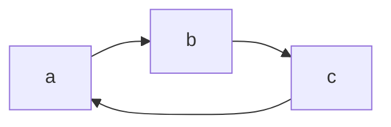
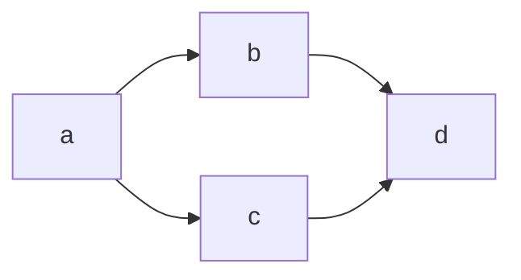

# Detect Build Cycle

## Task Overview

A build orchestrator receives a list of directed module dependency pairs and must abort before scheduling a build if any circular dependency exists in the dependency graph.

You are given a list of directed edges, where each edge is a pair of strings `(module, depends_on)` meaning `module` directly depends on `depends_on`. The full graph may contain multiple disconnected components — your function must check every component, not just the one reachable from a single starting node. A self-loop (a module that depends on itself) counts as a cycle.

The input format is a list of `(string, string)` pairs. Each string is a module identifier of length 1–32. There are no duplicate edge definitions, but a module may appear on both sides of different edges.

```
Edge list format:
  [("moduleA", "moduleB"), ("moduleB", "moduleC"), ...]
  meaning: moduleA depends on moduleB, moduleB depends on moduleC, etc.
```

Implement `has_cycle` in your chosen language.

---

## Examples

**Example 1:**



Input: edges = [("a","b"), ("b","c"), ("c","a")]

Output: true

Explanation: Following the directed edges produces the path a → b → c → a, which loops back to a — a three-node cycle exists.

---

**Example 2:**



Input: edges = [("a","b"), ("a","c"), ("b","d"), ("c","d")]

Output: false

Explanation: Node d is reachable from a via two distinct paths (through b and through c), but no edge points back toward any ancestor — this is a valid diamond-shaped DAG with no cycle.

---

**Example 3:**

Input: edges = [("a","a")]

Output: true

Explanation: A self-loop means a module depends on itself, which is a cycle of length one.

---

## Constraints

- `0 <= E <= 5 * 10^4` directed edges in the input list
- `1 <= N <= 10^4` distinct module identifiers across all edges
- Each module identifier is a non-empty string of length 1–32
- The graph may contain multiple disconnected components; all must be checked
- Self-loops are valid input and count as cycles
- An empty edge list `[]` contains no cycle — return `false`
- Return `true` if any cycle exists anywhere in the graph, `false` otherwise
- Target complexity: O(V + E) time, O(V + E) space

---

## How to Verify

- Open the `solution.*` file inside your chosen language folder and implement `has_cycle`; do not modify any other file
- **Python**: run `pytest` from the `python/` folder
- **JavaScript**: run `npm test` from the `javascript/` folder
- **TypeScript**: run `npm test` from the `typescript/` folder
- **Java**: run `mvn test` from the `java/` folder
- **C++**: run `make test` from the `cpp/` folder
- All tests in your chosen folder must pass with no failures
- Use only the standard library — no third-party graph or DSA packages
